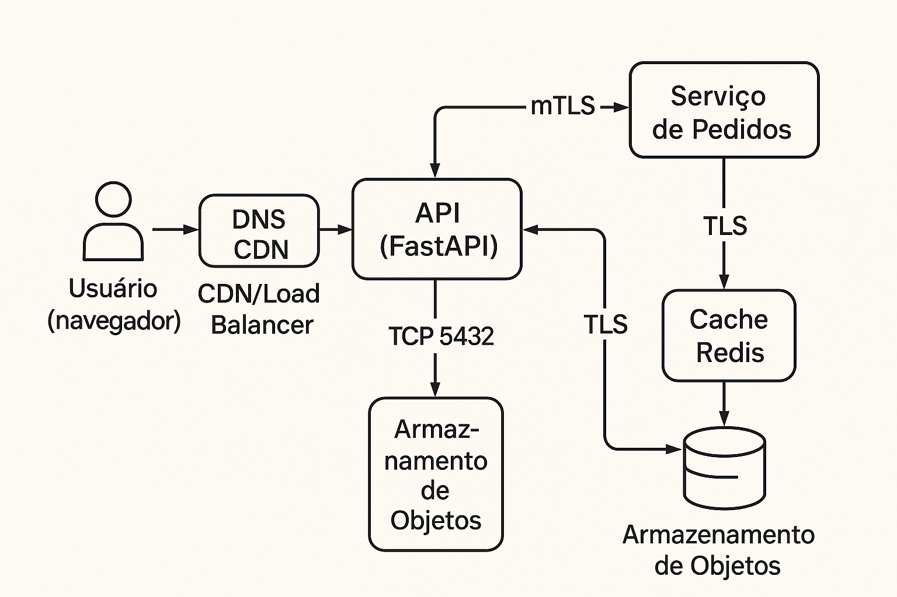

# Threat Modeling API — STRIDE via Vertex AI (Gemini) + FastAPI

Multimodal REST API that generates a **STRIDE** threat model from an **architecture image** + **application context** and returns **JSON**. This README explains how it works using the files in the `test/` folder.

---

## How it works (high level)
1. Client sends `multipart/form-data` to `POST /analyze_threats`:
   - `image` (PNG/JPG diagram)
   - `application_type`, `authentication_methods`, `internet_exposed`, `sensitive_data`, `application_description`
   - `prompt_language` (`en` or `pt`, defaults to `en`)
2. The API builds a **language-specific prompt** (EN/PT) that instructs Gemini to apply STRIDE and to reply **only with valid JSON**.
3. The API sends **text + image** to Gemini (Vertex AI) and returns:
   - parsed JSON (preferred), or
   - `{ "raw_text": "…" }` if the model didn’t return strict JSON.

---

## Test folder

- **test.png** → sample architecture diagram used as the request image (same topology shown above in this thread).
- **test_result_en.json** → example **English** output JSON with STRIDE threats and improvement suggestions produced for `test.png`. :contentReference[oaicite:0]{index=0}  
- **test_result_pt.json** → example **Portuguese** output JSON for the same image. :contentReference[oaicite:1]{index=1}

Both JSONs contain the two top-level keys the API expects the model to return: `"threat_model"` (list of objects with `"Threat Type"`, `"Scenario"`, `"Potential Impact"`) and `"improvement_suggestions"` (list of strings).

Use these files to validate that your local setup is working and that prompt language switching behaves as expected.

---

## Endpoint

**POST** `/analyze_threats`  
**Body:** `multipart/form-data`

**Fields**
- `image` *(file, required)*
- `application_type` *(text, required)*
- `authentication_methods` *(text, required)*
- `internet_exposed` *(text, required: `yes`/`no`)*
- `sensitive_data` *(text, required)*
- `application_description` *(text, required)*
- `prompt_language` *(text, optional: `en` or `pt`; default `en`)*

---

## Run locally

```bash
python -m venv .venv
source .venv/bin/activate
pip install -r requirements.txt   # fastapi, uvicorn[standard], python-dotenv, python-multipart, google-cloud-aiplatform
uvicorn main:app --host 0.0.0.0 --port 8000 --reload
